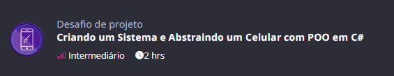

# 3-Celular

## ← [Voltar a raiz](../README.md)



## Descrição

- Aplicando conceitos de orientação a objetos com modelos de celulares
- É a continuação do projeto [**trilha-net-poo-desafio**](https://github.com/digitalinnovationone/trilha-net-poo-desafio)

## 📱 Como rodar o projeto

#### Dependências:
- [.NET 8.0](https://dotnet.microsoft.com/download/dotnet/8.0)

### 1- Clone o repositório
```bash
git clone https://github.com/Gustavoksbr/DioDotnet.git
```

### 2- Acesse a pasta do projeto
```bash
cd DioDotnet/3-Celular
```

### 3- Instale as dependências
```bash
dotnet restore
```

### 4- Execute o projeto
```bash
dotnet run
```