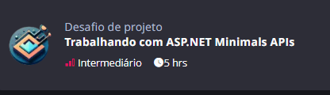

# 5-Minimal Apis

## ← [Voltar a raiz](../README.md)



## Descrição

- Continuação do projeto [minimal-api](https://github.com/digitalinnovationone/minimal-api)
- Sistema de autenticação de usuários com JWT + gerencimaento de veículos

## Como rodar o projeto

Para rodar o projeto, siga os passos abaixo:

1. Esteja dentro da pasta `minimal-api`:
   ```
   cd 5-MinimalApis/minimal-api
   ```
2. Restaure as dependências do projeto executando o comando:
    ```bash
    dotnet restore
    ```
3. Execute este comando para criar os arquivos com dados sensíveis:
    ```bash
    .\copy_examples.sh
    ```
4. Configure a string de conexão com o MySQL no arquivo `appsettings.json`:
    ```json
    {
      "ConnectionStrings": {
         "DefaultConnection": "Server=localhost;Database=nome_do_banco;User=root;Password=sua_senha;"
      }
    }
    ```
5. Adicione as migrações do Entity Framework:
    ```bash
    dotnet ef migrations add InitialCreate
    ```
6. Execute as migrações do Entity Framework para criar o banco de dados:
    ```bash
    dotnet ef database update
    ```
7. Execute o projeto:
    ```bash
    dotnet run
    ``` 
   
## Testando os endpoints

