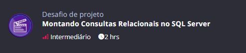

# 6-AgendamentoTarefas

## ← [Voltar a raiz](../README.md)




## Descrição

- Continuação do projeto [trilha-net-api-desafio](https://github.com/digitalinnovationone/trilha-net-api-desafio)
- CRUD de tarefas com Entity Framework e Sql Server

## Como rodar o projeto

Para rodar o projeto, siga os passos abaixo:

1. Esteja dentro da pasta `trilha-net-api-desafio`:
   ```
   cd 6-AgendamentoTarefas\trilha-net-api-desafio
   ```
2. Restaure as dependências do projeto executando o comando:
    ```bash
    dotnet restore
    ```
3. Execute este comando para criar os arquivos com dados sensíveis:
    ```bash
    .\copy_examples.sh
    ```
4. Deixe o banco de dados rodando. Neste caso é o Sql Server

5. Configure a string de conexão com o Sql Server no arquivo `appsettings.json`. Por padrão, está assim:
    ```json
    {
      "ConnectionStrings": {
         "DefaultConnection": "Server=localhost\\SQLEXPRESS;Database=AgendamentoTarefas;Trusted_Connection=True;TrustServerCertificate=True;"
      }
    }
    ```
6. Adicione as migrações do Entity Framework:
    ```bash
    dotnet ef migrations add InitialCreate
    ```
7. Execute as migrações do Entity Framework para criar o banco de dados:
    ```bash
    dotnet ef database update
    ```
8. Execute o projeto:
    ```bash
    dotnet run
    ```
## Testando os endpoints

...