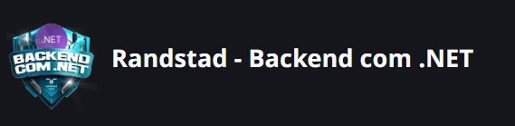

# 🚀 Bootcamp Randstad - Backend com .NET

- Este repositório contém uma coleção dos desafios de projeto desenvolvidos durante o bootcamp [**Randstad - Backend com .NET**](https://www.dio.me/bootcamp/coding-future-back-end-dot-net) da plataforma DIO (Digital Inovation One)
- Cada projeto explora diferentes conceitos, e está organizado em pastas numeradas na raiz deste repositório.

## 📂 Projetos

Clique no nome do projeto para acessar o seu README correspondente:

- [Estacionamento](./1-Estacionamento/README.md)
- [Hospedagem](./2-Hospedagem/README.md)
- [Celular](./3-Celular/README.md)
- [SqlServer](./4-SqlServer/README.md)
- [MinimalApis](./5-MinimalApis/README.md)
- [Agendamento de Tarefas](./6-AgendamentoTarefas/README.md)
- [Azure](./7-Azure/README.md)
- [Funcionários](./8-Funcionarios/README.md)

## 🔄 Navegação

Cada subprojeto possui um arquivo `README.md` com:
- Uma descrição detalhada do projeto.
- Tecnologias utilizadas.
- Instruções de execução.

Você pode retornar a este README principal clicando no link fornecido em cada README de subprojeto.

## Autor

- [Gustavoksbr](https://github.com/Gustavoksbr)
